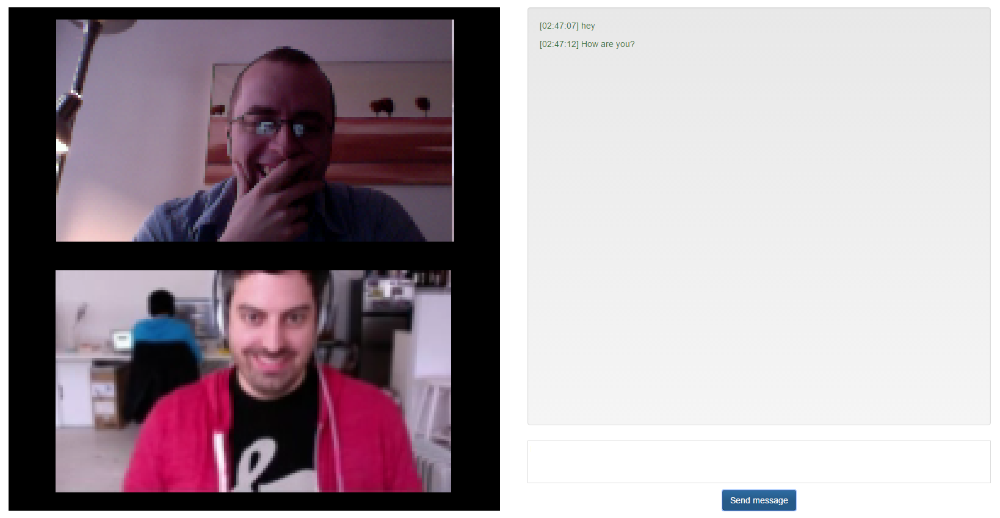

# Serverless WebRTC Chat
This is a serverless, opensource (duh, you're on github), encrypted, p2p chat app. It is available on:
* [Web](https://adam-hanna.github.io/serverless-webrtc/)
* iOS, and
* [Android](https://play.google.com/store/apps/details?id=org.unicomm)

It is a fork of [cjb / serverless-webrtc](https://github.com/cjb/serverless-webrtc) that extends that library to iOS and Android.

Two users who wish to chat with each other exchange png's which contain encoded information. This encoded information is used to establish the connection between the two parties.

There is no third party involved (except stun:23.21.150.121, of Amazon.com, which is used to ascertain the two party's IP addresses), so there is no record kept of the conversation (except for maybe by the ISP), and the data (which is encrypted) is transmitted directly between the two parties. Finally, and best of all, the source code is open and provided, here.

## Why?
Free and open communication is a human right. Without it, the spread of ideas is hindered and human progress slowed.

I believe that the only technologies that protect this right are decentralized, encrypted, peer-to-peer and open source. To that end, I hope this little project may be a slight contribution.

## Preview

## Usage
### Web
To start the web version (for various reasons, running from the static index.html file in the cordova/platforms/browser/www folder may not work):

~~~ bash
serverless-webrtc 		  $ cd vue
serverless-webrtc/vue   $ npm install
serverless-webrtc/vue 	$ npm run dev
~~~

### iOS
Unfortunately, Apple wouldn't approve this app. In their opinion, it violated one of their rules, specifically that apps "... [have the ability] to block abusive users from the service." Without a back-end, that's impossible. In my opinion, all users are blocked until you decide to exchange png's and chat (which happens outside the app), but whatever...

However, you can still get this app on your iOS device, just follow the instructions below.

~~~ bash
serverless-webrtc 			  $ cd vue
serverless-webrtc/vue     $ npm install
serverless-webrtc/vue 		$ npm run build
serverless-webrtc/vue 		$ cd .. && cd cordova
serverless-webrtc/cordova $ cordova build ios
~~~

Finally, using XCode, open `UniComm.xcodeproj` located in `cordova/platforms/ios` and run the app on your phone.

### Android
~~~ bash
serverless-webrtc 			  $ cd vue
serverless-webrtc/vue     $ npm install
serverless-webrtc/vue 		$ npm run build
serverless-webrtc/vue 		$ cd .. && cd cordova
serverless-webrtc/cordova $ cordova build android
~~~

## TODO
1. Release for other platforms (Windows Phone, Amazon Fire OS, Firefox OS, Tizen, etc.). Any help here would be greatly appreciated. Feel free to release working apps to those stores.
2. Finish file transfer functionality.
3. General UI / UX improvements.
4. Tests!
5. Convince Apple to stop being arsehats and accept the app into their store